# CSS

层叠样式表。

- CSS属性采用键值对方法 属性名:属性值。

# 位置分类

## 内联样式表

样式写到标签内部，控制`当前标签`的样式，特殊情况使用。

~~~css

文件内容

~~~

## 内部样式表

写的`<`head>标签中，脱离结构，可以控制`当前页面`的所有标签，较为常用。

## 外部样式表

单独新建一个CSS文件，控制`整个网站`的的所有标签。

~~~css
<link rel="stylesheet" href="./css/index.css">
~~~

# CSS选择器

- `继承性`。

  子元素自动继承父元素的某些CSS样式属性。
  1.主要继承跟文字相关的样式属性，比如字体、颜色、文本对齐等
  2.但是子元素定义自己样式，会`优先自己`样式。

- `优先性`。优先级是基于不同种类`选择器`组成的`匹配规则`
  原则:
  1.优先级相等的时候,CSS中最后的那个声明的样式将会被应用到元素上。(层叠遵循`就近`原则)
  2.其余判断那个选择器权重高,优先执行那个样式。
  3.权重是4位一组,是分开的层级,不能进位。

- importan!>`内联样式`>`ID`选择器>类/伪类/`(属性)`选择器>标签/`伪元素`>`通配符`/继承选择器
  
  | 选择器类型        | 示例                     | 权重值    | 优先级说明                  |
  | ----------------- | ------------------------ | --------- | --------------------------- |
  | !important        | color: red !important    | 无限大    | 强制覆盖所有规则(慎用)      |
| 内联样式          | 
 | (1,0,0,0) | 行内样式权重最高(1,0,0,0)   |
  | ID选择器          | #myld                    | (0,1,0,0) | 每个ID增加0,1,0,0           |
  | 类/伪类/`属性`    | .class，[type="text"]    | (0,0,1,0) | 每个类/属性/伪类增加0,0,1,0 |
  | 伪元素/类型(标签) | div,::after              | (0,0,0,1) | 每个类型/伪元素增加0,0,0,1  |
  | 通配符/继承       | *,继承的样式             | (0,0,0,0) | 通配符和继承权重最低        |
  
  权重可以**累加**，但是不允许**进位**。
  
  

  > 范围小，权重大。
  
- `CSS层叠性`

  CSS规则可以同时作用于一个元素，浏览器通过特定规则决定最终生效的样式。层叠性解决了样式冲突问题。原则：后定义的样式覆盖先前的样式。（`就近原则`）

  CSS书写规范

## 基础选择器

指的是有`单个选择器`组成，常见如下:

### 类型选择器

又称为标签选择器。

- 权重低

~~~css
p {
    color: gold;
}
~~~

就近原则又称为`后来居上`，远亲不如近邻。（从上往下覆盖，上被覆盖。谁离内容更近，谁被应用。）

### 类选择器

类叫class ，后期修改样式常用

- 权重>类型选择器

~~~css
.box {
    color: gold;
}
~~~

~~~html

~~~

类名命名规范_注意:
1.类名自定义,不能是中文、纯数字
2.多个英文单词组成尽量使用-链接
3.命名有要意义,尽量见名知义
4.class属性可以有多类名中间用空格隔开

### id选择器

- id属性必须`唯一`元素，后期配合JavaScript添加交互效果

~~~CSS
#box {
    color: gold;
}
~~~

~~~html

修改样式

~~~

### 通配符选择器

- 通配符选择器可以选择HTML中所有的标签,进行样式修改。

~~~css
* {
    margin: 0;
    padding: 0;
    box-sizing:border-box;
}
~~~

### 区分四种基础选择器

| 选择器 | 类型选择器 | 类选择器                      | id选择器                   | 通配符选择器     |
| ------ | ---------- | ----------------------------- | -------------------------- | ---------------- |
| 语法   | 直接选择   | 以`.`开头，后跟类名(.nav)     | 以#开头，后跟id名(#header) | `*`              |
| 作用   | 选类型(p)  | 选择class属性的一个或多个元素 | 选择特定id的`唯一`元素     | 选择HTML全部标签 |
| 类似   |            | 身份证的名字，多次使用        | 身份证号码，唯一           | 所有             |
| 场景   | 一整个标签 | 后期修改基本都是              | 后期配合JavaScript添加交互 | 奠定基础页面大小 |

## 关系选择器

通过`位置关系`来选择目标元素（标签），可以更精准选择某些元素，常见如下:

### 后代选择器

选择某个元素的`后代`元素(不限层级,包括子元素、孙元素等)

~~~css
.box/div(类/类型选择器) p {
    color: pink;
}
~~~

~~~html

    
我是文字 

我是文字

~~~

### 子代选择器

选择某个元素的直接`子元素`(仅限一层)

~~~css
.box/div>span {
    color: pink;
}
~~~

~~~html

    我是儿子
    

        我是孙子
    

~~~

### 邻接兄弟选择器`+`

选中紧跟在h2/box类后面的`第一个`p元素

~~~css
h2/.box+p {
    color:red;
}
~~~

~~~html

  
文字内容

  
文字内容

  
文字内容

  <h2 class="box"> 标题 </h2>
  
文字内容

  
文字内容

~~~

### 通用兄弟选择器`~`

选中紧跟在h2/box类`后面的所有`p元素

~~~css
h2/.box~p {
    color: blue;
}
~~~

### 区分四种关系选择器

| 选择器         | 语法 | 选择范围             | 实例                       |
| -------------- | ---- | -------------------- | -------------------------- |
| 后代选择器     | A B  | 所有后代（跨层级）   | ul li {color: pink;}       |
| 子代选择器     | A>B  | 直接子元素（仅一层） | div>span {color: pink;}    |
| 邻接兄弟选择器 | A+B  | 紧邻的下一个同级元素 | h2+p {}标题后的第一个p元素 |
| 通用选择器     | A~B  | A之后的所有同级元素  | h2~p {}标题后的所有p元素   |

## 分组选择器

并集选择器。将不同的选择器`组合`在一起，用逗号分割。

- 多个元素具备相同风格。

~~~css
div,
span {
    color: pink;
}
~~~

## 伪类和伪元素

### 状态伪类

根据用户交互或者状态变化选择。（鼠标经过连接、表单获取焦点等）

| 链接伪类  | 作用                                 |
| --------- | ------------------------------------ |
| a:link    | 未访问链接的默认样式                 |
| a:visited | 已访问链接的样式                     |
| a:hover   | 鼠标悬停在链接上时的反馈             |
| a:active  | 链接被点击时的瞬时状态（按下到松开） |

伪类顺序规则（`LVHA`顺序）a:link->a:visited->a:hover->a:active

- 用户行为伪类。`用户`以某种方式和文档交互的时候应用，有时叫`动态伪类`。(a:hover)

### 结构伪类

根据元素的位置选择。（选择第五个第十个元素、选择前三个元素等）

| 结构伪类       | 作用                                                         |
| -------------- | ------------------------------------------------------------ |
| li:first-child | 一组兄弟元素的第一个元素                                     |
| :last-child    | 一组兄弟元素的最后一个元素                                   |
| :nth-child(n)  | 一组兄弟元素的第n个元素（1开始。odd/偶数/even/奇数。3n/n+2 第二个及以后/-n+3前三个） |

- 公式里的n从`0`开始计算。

### 表单伪类

针对表单元素状态。（表单禁用、选中复选框等）

~~~css
input:disabled/:checked{
    background-color:#ccc;
}
~~~

### 伪元素选择器(`::`)

- 让表单里面的placholder文字变颜色。

~~~css
  p::first-line {
    font-weight: bold;
    color: red;
    font-size: 18px;
  }
~~~

| 伪元素选择器                                      | 作用                                     |
| ------------------------------------------------- | ---------------------------------------- |
| ::first-line                                      | 选择首行（超过显示器第一行就开始不变色） |
| ::first-letter                                    | 首字母                                   |
| ::placeholder                                     | 选择input或者textarea占位符              |
| `以下更重要！`(属性类似内联元素)                  | `以下更重要！`                           |
| ::before content(必须包含content，可空，不可省略) | 元素内插入伪元素，作为第一个元素         |
| ::after content(必须包含content，可空，不可省略)  | 元素内插入伪元素，作为最后一个元素       |

~~~css
div::before {
    content: "开始";//必须包含，可空，不可省略
    color: red;
}
div::after {
    content: "结束";//必须包含
    color: red;
}
~~~

## 属性选择器

根据属性特征来精准定位元素。

- 表单样式控制
- 图标字体控制
- 国际化语言适配

| 属性选择器    | 作用                                   |
| ------------- | -------------------------------------- |
| a[属性/class] | 匹配`包含`指定属性的元素               |
| [属性=值]     | 匹配属性值`等于`指定值的元素           |
| [属性`^`=值]  | 匹配属性值以指定字符串`开头`的元素     |
| [属性$=值]    | 匹配属性值以指定字符串`结尾`的元素     |
| [属性`*`=值]  | 匹配属性值`任意位置`包含指定字串的元素 |

# CSS文本样式

## 字体样式

使用哪种字体、字体大小、字体粗体、斜体等等

### 字体颜色color

- 关键字(red/blue/pink)
- 十六进制(#FF0000/#F00)
- rgb格式(代表红绿蓝(255,0,0)/rgba(255,255,255,`0.3`) 0.3代表透明度，0全透明，1不透明)

### 字体族font-family

给定一个有`先后顺序`的,由字体名或者字体族名组成的列表来为选定的元素设置字体

~~~css
 body {
     font-family: Arial,Helvetica,sans-serif;
 }
~~~

属性值用`逗号`隔开。浏览器会选择列表中第一个该计算机上有安装的字体

### 字体大小font-size fz

像素px。CSS像素是CSS中用于定义长度、尺寸的单位。`绝对单位`。

~~~css
body {
    fontsize: 16px;
}
~~~

### 字体风格font-style

打开和关闭italic(斜体)/normal(正常)。

### 字体粗体font-weight

400/normal正常、700/bold加粗。

### 字体装饰text-decoration

设置/取消字体上的文字装饰。none(取消装饰)/underline(下划线)/overline(上划线)/line-through(穿过文本线);

## 文本布局

文本对齐、行高、字间距、首行缩进等等

### 文本对齐text-align

控制文本在所在`块级盒子`内如何水平对齐

- 文本/图片在盒子水平对齐
- 文章文字两端对齐

left/right/center(居中对齐)/justify(自动改变间距，两端对齐)

### 首行缩进text-indent

设置`块级元素`中文本行前面空格(缩进)的长度

~~~css
p {
    text-indent: 2em/px;
}
~~~

### 字间距letter-spacing

用于设置文本字符的间距(px)

- 调整字与字之间距离

### 行高line-height

文本每行之间的高(px/当前字体大小的倍数)

- 设置多行文本之间的`上下间距`
- 让单行文本`垂直居中`行高=盒子高度(把文字挤到中间)

## font简写

font简写属性在一个声明中设置多个字体属性

- font:font-style font-weight font-size/line-height font-family;
  
- 其中font-size和font-family是`必须写`
   其他可以省略,`默认显示`
   
   `font-size/line-height`,顺序`固定`

# 盒子模型

CSS盒模型整体上适用于`区块盒子`，包括盒子`内容、内边距、边框、外边距` 四部分。

- 内边距padding、外边距margin(内p外m)

## 边框  border

设置盒子四条或者单独边框。
border:边框粗细 边框样式 边框颜色;

- 边框有三部分属性值组成,中间必须空格隔开。
-  三部分属性值没有先后顺序。

~~~css
 border:1px solid #f1f1f1;
~~~

 边框样式           描述 
  dotted           点状边框
  dashed          虚线边框 
   solid             实线边框        

- 根据方位名词。(top bottom left right)/`上下左右`

### 圆角边框 border-radius

 border-radius:左上角 右上角 右下角 左下角;`顺时针`

~~~css
.button {
    boder-radius: 10px;
}
~~~

胶囊按钮=Min(宽度/高度)/2

- 根据radius(半径)进行画圆形，然后把多余的删掉，保留共有的

## 内边距 padding

padding: 上 右 下 左;`顺时针`

- 垂直居中|竖直居中（行高＝高      line-height=height）

## 外边距 margin

margin:上 右 下 左;`顺时针`

1.`行内`元素`左右外边距`生效,上下外边距无效。
2.行内元素设置宽度和高度也无效。

水平居中:

区块元素可以利用marign实现`水平居中`。

- 块级盒子必须`有宽度`
- 只需要设置左右外边距为auto就可以

margin=auto`居中原理`：

Margin-left=auto会占满所有的左边，盒子会到最右边。

Margin-right=auto会占满所有的右边，盒子会到最左边。

margin=auto会各占满左右两边的相等大小的区域，所以显示居中。

### 外边距折叠

`区块`元素`上下`外边距会出现折叠(合并)情况。

- `并列`关系(兄弟)的区块元素。
-  两个上下外边距将合并为一个外边距。其大小等于`最大的单个外边距`

上下都给同一段空间设置外边距，取两者外边距的**最大值**。较小值忽略，简称折叠。

### 外边距塌陷

孩子会带着父亲元素一起走，叫塌陷。

区块元素上下外边距会出现塌陷情况。

- `嵌套`关系(父子)的区块元素。 
-  给子盒子设置上下外边距会让父盒子塌陷移动。

解决方案(三种方法均可):
1.给父盒子添加`上边框`。(父盒子本身有边框则不会出现问题)
2.给父盒子添加`上内边距`。(同理)
3.给父盒子添加: `overflow: hidden;`属性

##尺寸计算

box-sizing用于定义元素的盒模型计算方式,控制元素的width和 height 是否包含 padding和 border

box-sizing:属性值; 

content-box  = width = 内容的宽度(默认值)
border-box = width =border+padding+内容的宽度

实际开发中,我们也更提倡使用`border-box`,可以直接让所有标签修改

## 盒子背景

background用于设置元素背景相关属性,包括背景颜色、背景图片、背景位置、背景重复方式等

| 属性              | 作用                 | 常用值                                      | 示例代码                           |
| ----------------- | -------------------- | ------------------------------------------- | ---------------------------------- |
| background-color  | 设置元素背景颜色     | 颜色名称、十六进制、RGB、透明度             | background-color:#fofof0;          |
| background-image  | 设置背景图片         | url(image.jpg)                              | background-image:     url(bg.png); |
| background-repeat | 控制背景图片是否重复 | repeat(默认)、no-repeat、repeat-x、repeat-y | background-repeat:no-repeat;       |

background-position:center  定位背景图片位置 x y(如center top ,或者px、%单位)  

> 随着视口（屏幕的大小）的移动而移动

background-size: cover;          调整背景图片尺寸  默认auto、cover、contain或者px、%

> cover(覆盖:`填满容器,可能裁剪图片`)、contain(包含:`保持图片完整,可能留白`)

background-attachment:fixed   背景是否随页面滚动                scroll(默认)、fixed               

### background的复合写法

background：颜色 图片 重复 固定 位置／尺寸； 

> 顺序无关

### 背景渐变

在CSS中，可以通过 linear-gradient（线性渐变）和 radial-gradient（径向渐变）为元素添加渐变背景

- 线性渐变  linear-gradient

background: linear-gradient(to right, #ff6b6b,#4ecdc4)

linear-gradient（方向，颜色1 位置，颜色2 位置．．．）

- 线性渐变（方向可控）

background-image:linear-gradient(90deg, #ff6b6b 30%, #4ecdc4 70%)

radial-gradient（形状，颜色1，颜色2．．．）

>  90deg=to right→(基准是竖直向上上)

径向渐变（形状和位置可控）

radial-gradient(circle,#ff9a9e,#fad0c4)

色标指的是`颜色占比`的多少。

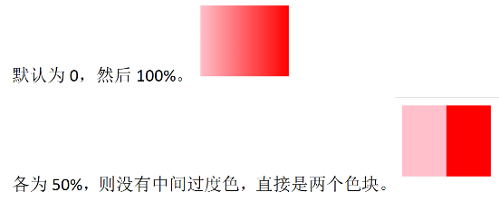

### 文字渐变

~~~css
／＊-webkit-前缀 谷歌浏览器老版本的兼容性写法＊/
-webkit-background-clip: text;
／＊背景裁剪 以文字的形式裁剪 ＊／
background-clip: text;
／＊文本填充颜色 为透明＊／
-webkit-text-fill-color: transparent;
~~~

## 盒子阴影

box-shadow:(inset)X轴偏移量(px) Y轴偏移量 模糊半径 扩散半径 颜色;

- XY的偏移量，X越大，向右正半轴偏移

  Y越大，向下正半轴偏移

- 模糊半径指的是影子颜色的深淡/柔和与否

- 扩散半径是外面扩散阴影的大小（需要内扩散+属性最前面inset 然后扩散为内里）

X轴偏移量和Y轴偏移量是`必须`要写，其余可以省略采取默认值0。

- 过渡 transition :过渡属性all 过渡时间3s;

过渡用于与在元素的属性值发生变化时，平滑的过渡。

> 过渡一定要写到`盒子本身`,谁过渡给谁加！(.box/.box:hover +.box)->复原状态->`慢慢`
>
> 也可写`hover`上，经过变状态，离开返回原状态->`立马`

# 样式初始化

## 整体文件初始化

~~~css
* {
    margin:0;
    padding:0;
    box-sizing:border-box;
}

ul,
ol {
    list-style:none;
}

a{
    text-decoration:none;
}
~~~

- 一般是导入一个外部的css文件。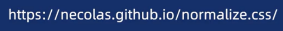

## 单行文本溢出省略

overflow: hidden;／＊溢出隐藏 ＊／

`text-overflow: ellipsis;`／＊文本溢出显示省略号 ＊／

`white-space: nowrap;`／＊强制文字一行显示，不换行 ＊／

## 多行文本溢出省略

多行行文字溢出显示省略号：

display:-webkit-box;／＊旧版弹性盒子布局＊／

`-webkit-box-orient: vertical`;／＊文本垂直排列 ＊／

-webkit-line-clamp: 3;／＊限制显示行数＊／

overflow: hidden;／＊隐藏溢出内容＊／

text-overflow: ellipsis;／＊文本溢出显示省略号＊／

> 修改盒子高度为 正好显示行数的高度

# 字体图标

字体图标(Icon Fonts)是一种将图标以`字体形式`嵌入网页的技术，允许开发者像使用`文字`一样通过CSS控制`图标的样式`

- 方法

  1.下载字体图标文件

  2.引入HTML文件中

  3.使用字体图标(选择font class->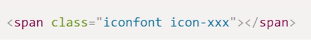 `!类里的-后没有'  . '`)

- 使用场景：

1． 导航菜单图标。

2． 按钮操作图标。

3． 结合动画效果。

- 优势：

1．矢量缩放：无损放大缩小

2．样式灵活：通过CSS直接修改颜色、大小、阴影等属性。

3．减少HTTP 请求：一个字体文件可包含多个图标，比多张图片更高效。

4．兼容性好：支持所有现代浏览器，甚至部分旧版浏览器。

## 精灵图

CSS精灵图（CSS Sprites）是将多个小图标或图像合并到一张大图中，通过调整background-position属性来显示特定部分的图像技术。

原理：
1.给盒子添加背景图片。
2.通过`背景`定位（background-position）移动位置对齐。(移动`背景`图片!`右下`是正的，`左上`是负的)
3.注意网页坐标不同。

原点在左上角的(0,0)

> span的class="box box1"，可以公用的用.box{xxx}，然后再.box1{xxx}

# CSS布局

## 正常布局

正常布局流（normal flow）是指在不对页面进行任何布局控制时，浏览器`默认的`HTML布局方式。也称为`标准流`。
正常布局流是CSS布局的基石，页面大的布局基本就是利用`区块`元素`从上到下`、`从左到右`罗列而成。

### 区块元素

- 独占一行、宽度默认撑满父容器。
- 垂直方向排列、可设置宽高。
- div、p、h1

### 行内元素

- 水平方向依次排列，直到容器`宽度不足`则换行。
- 宽度和高度`由内容决定`，无法直接设置。
- span、img、strong

## 模式转换布局

display属性允许我们**更改**`默认的`显示方式此属性。

display:block/inline/inline-block;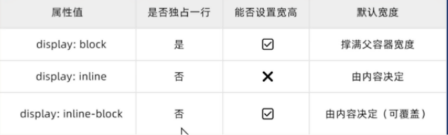

### 转换为行内块元素 display:inline-block;

- 让块级盒子一行显示
- 让行内元素可以设置宽高

既想在一行上，又想调整大小

注意:

1.行内块元素中间会有`空白`缝隙。给父元素`字号改为0`可以去掉。

> 先给父元素的font-size:0px，随后给li里的font-size:14px

2.实际开发适合于对间距要求不高的情况下可以转换。
3.如果真的要精细布局，请用`flex`或者`grid`更合适。

## 浮动布局(已弃用)

浮动（float）可以让元素`脱离文档流`，向左或向右浮动，直到碰到`父容器边缘或其他浮动元素`

float:left/right/none;

如果`均为左浮动`，设置好`margin-right:x`的值，`最后一个`盒子浮动设置为`margin-right:0`

浮动影响:

1.父盒子没有高度。（很多情况下不能给父亲指定高度）
2.子元素浮动。
3.影响其他盒子布局。

### 清除浮动

清除浮动也可以理解为`闭合浮动`，简单来说，就是让浮动的元素尽量控制在`父盒子内`，不要影响其他盒子。

- 额外标签法

在浮动元素的最后面，`新增`一个`块级`标签。clear:both

- 单伪元素清除浮动

父元素添加单个伪元素(after+after)

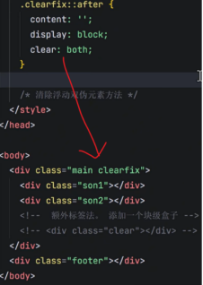

- 双伪元素清除浮动

父元素添加双伪元素(before+after+after)

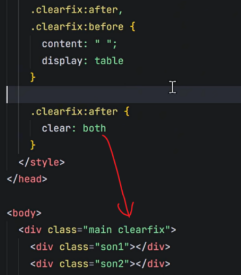

- overflow清除浮动

父元素添加overflow

## 弹性布局

伸缩布局-`随着网页的变动而变动` flexbox 

Flexbox是CSS弹性盒子布局模块（Flexible Box Layout Module）的缩写，可以快速实现元素的`对齐、分布和空间分配`。

弹性盒子核心：

- 1.父控子（亲父子）
  父盒子`控制`子盒子如何排列布局
  父盒子称为`容器`，子盒子称为`项目`
- 2.主轴(水平向右 → )和交叉轴（侧轴）
  主轴默认水平方向，交叉轴默认垂直方向，可以更改

### 弹性模式 display:flex `父盒子`

(父控子，要加在`父盒子`上)

- 如果子元素有大小，则按照给定大小来显示。
- 如果子元素没有大小，则(高度)拉伸充满父容器。(长度视子盒子里的内容敲定)
- 若子元素总宽度超过容器宽度，默认会压缩子元素。

### 主轴对齐方式 justify-content:flex-start;

| 属性值     | 效果         | 属性值        | 效果                              |
| ---------- | ------------ | ------------- | --------------------------------- |
| flex-start | 左对齐(默认) | space-between | 两端对齐                          |
| flex-end   | 右对齐       | space-around  | 项目两侧间隔相同/盒子两侧空白一致 |
| center     | 居中对齐     | space-evenly  | 项目间隔均匀分布/平均分配剩余空间 |

### 交叉轴对齐方式(单行) align-items:flex-start;

| 属性值     | 作用                 | 属性值  | 作用                                       |
| ---------- | -------------------- | ------- | ------------------------------------------ |
| flex-start | 交叉轴起点对齐(上面) | center  | 交叉轴居中对齐                             |
| flex-end   | 交叉轴终点对齐(下面) | stretch | 项目拉伸至填充整个容器高度(若子项目无高度) |

### 改变主轴方向 flex-direction:row;

| 属性值      | 描述                          | 属性值         | 描述                      |
| ----------- | ----------------------------- | -------------- | ------------------------- |
| row         | 默认值。子元素沿水平→主轴排列 | column         | 子元素沿垂直↓主轴排列     |
| row-reverse | 子元素沿水平反向←主轴排列     | column-reverse | 子元素沿垂反向↑直主轴排列 |

### 控制是否换行 flex-wrap:nowarp;

父盒子`不给高度`，子盒子就撑开自适应高度。

| 属性值       | 排列效果                                                     |
| ------------ | ------------------------------------------------------------ |
| nowrap       | 不换行ABCDEFGH（全部横向排列，可能被压缩)                    |
| wrap         | ABCD EFGH(ABCD第一行上方，EFGH第二行下方) 换行               |
| wrap-reverse | EFGH ABCD（EFGH第一行下方，ABCD第二行上方） 翻转（了解即可） |

### 交叉轴对齐方式(多行)align-content:flex-start;(少)

（仅当`flex-wrap:wrap`且内容换行时生效）

与justify-content类似

### 间距gap

gap简写属性用于设置行与列之间的间隙（间距）

gap:20px;行和列之间保持20像素间距。

- 控制子元素之间保留间隙

> 盒子换行还不用掉下来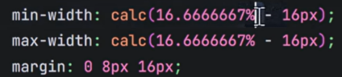

### `子盒子`flex:1

flex指的是`剩余空间`分配的`比例多少`。flex:1;一个占一份。flex:2;一个占两份。

flex=flex-grow+flex-shrink+flex-basis(是否拉伸 是否缩放 小盒子占比的大小)

| 属性        | 作用                                                         |
| ----------- | ------------------------------------------------------------ |
| flex-grow   | 定义子元素剩余空间分配放大比例(默认0，即`不放大`)            |
| flex-shrink | 定义子元素剩余空间分配缩小比例（默认1，空间不足时等比`缩小`，0为不缩小） |
| flex-basis  | 定义项目在主轴方向上的初始大小(默认`auto`，优先级高于width/height) |
| flex        | flex-grow、flex-shrink、flex-basis 的简写。flex:1→1 1 0%（等比放大/收缩，初始无基准尺寸) |

### 解决图片底部空白缝隙问题 vertical-align: middle;

基线：浏览器行内元素（行内块元素）排版中存在用于对齐的 `默认基线`（baseline）

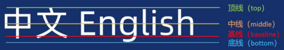

解决方法:
1.把图片转换为块级元素。
2.设置图片对齐方式不是基线对齐即可。

~~~css
img{
    vertical-align: top/middle;
}

~~~

### 垂直对齐-解决图片底部空白缝隙问题

- 让文字和图片都垂直居中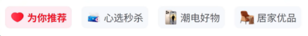

~~~css
img {
    border: 0;
    vertical-align: middle;
}
~~~

### LOGO

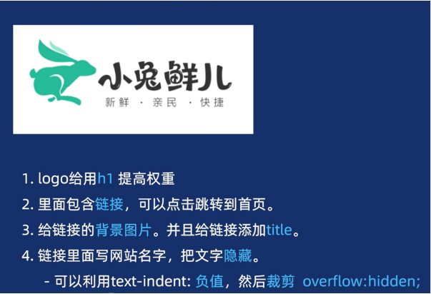

## 定位布局

position

### 相对定位(子绝父相-是绝的爹)

`不脱离`正常流，元素`原位置`仍被`保留`。

~~~css
position:relative;
~~~

- 元素相对于`自身正常`位置进行偏移
- 优先级：若同时设置top和bottom，仅top生效；同理left覆盖right。`左上原则`

进行`移动`(top、bottom、left、right)，后到达`原位置`|top:100px->移动后的图片往上100px才可以到原图片的位置。

### 绝对定位

元素`脱离`正常流，`不占据`空间。基于`定位基准`(祖先or浏览器视口)。

~~~css
position:absolute;
~~~

- `脱离`正常流并基于`定位基准`进行偏移。
- 相对于最近的已定位`祖先`元素（position非static）移动位置。若都`无定位`则相对于`视口`来定位。
- 优先级：若同时设置top和bottom，仅top生效；同理left覆盖right。`左上原则`

同等子标签给+absolute的标签高人(标签)一等，低的就被覆盖掉( `a卡片盖报纸`)

进行`移动`(top、bottom、left、right)，后到达`原位置`|top:100px->移动后的图片往上100px才可以到原图片的位置。

> 结合父盒子position:relative，子盒子position:absolute就可以根据父盒子的位置来移动，要不然就定位`视口`

**top的意思:离x上面多少px**

> **绝对路径**：从 **根目录（盘符）** 开始写(绝=根目录)
>
> **相对路径**：从**当前所在位置**开始写(相对当前)

- 让盒子的左右切换的按钮左右两边对齐(垂直居中)

先设置按钮为绝对定位absoulute,top:50%，设置盒子高度为一半60px->margin-top:30px(60/2)

### 固定定位

元素`脱离`文档流,不占据空间。并始终相对于浏览器`视口`定位的布局技术。

~~~css
position:flexed;
~~~

- 始终相对于浏览器窗口（视口）定位，滚动页面时位置`不变`
- `左上`原则

场景：
1.固定导航栏。页面滚动时导航栏始终固定在视口顶部。
2.页面广告。广告覆盖整个页面。

### 粘性定位

是一种`混合`定位模式，结合了`相对`定位（relative）和`固定`定位（fixed）的特性。

~~~css
position:sticky;
top:0;
~~~

> 必须写`方位+sticky`

- 元素在滚动到指定位置（如top：10px）前为相对定位，之后转为固定定位
- 父容器的overflow需为`visible`，否则粘性定位失效
- 可以通过top、bottom、left、right属性进行`偏移`
- 须`指定`top，right，bottom或left四个其中之一，才可使粘性定位生效

场景：
1.吸顶效果。元素在滚动到某个位置后固定。
2.表格表头固定。长表格滚动时表头始终可见。

### z-index层级

z-index属性用于控制元素在`三维`空间中的`层叠`顺序（即Z轴方向）。当多个元素在同一个平面（如同一行或列）
`重叠`时，z-index决定哪个元素显示在`最上层`。

z-index:数值;设定层级

- 值类型：整数（正数、负数、零）或auto。数值越大，层级越高
- 默认值：auto（等同于未设置，后出现的元素覆盖前者）。类似`层叠性`。
- 生效条件：仅对`定位元素`（position值为relative、absolute、fixed或sticky）有效。

### 五种定位类型比较

static是`默认`的

| 定位类型 | 脱离文档流 | 定位基准          | 层叠控制 | 典型场景                 |
| -------- | ---------- | ----------------- | -------- | ------------------------ |
| static   | 否         | 默认文档流        | 无       | 普通元素布局             |
| relative | 否         | 自身正常位置      | 支持     | 微调元素、子绝父相       |
| absolute | 是         | 最近定位祖先/视口 | 支持     | 弹窗、下拉菜单、悬浮元素 |
| fixed    | 是         | 视口              | 支持     | 固定导航栏、返回顶部按钮 |
| sticky   | 否         | 视口或滚动祖先    | 支持     | 吸顶导航栏、侧边栏固定   |

## 网格布局

Grid:`二维`布局，可以同时控制行和列的排列，实现真正的二维布局。实现`响应式`设计。

key:`创建`好网格并`放入`各类元素|单行flex,多行flex

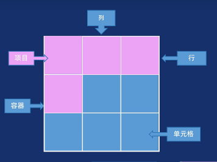

### display:grid/display:inline-grid

容器(父盒子)设置display:grid;(块级)/display:inline-grid;(行内)

~~~css
display:grid;//默认只有`一行`
~~~

`默认`按`行`来排列

### 网格轨道（Grid Tracks)

决定了网格容器的基础布局结构，为子元素提供放置的位置。

- 绘制网格：（网格轨道）

grid-template-columns定义网格中的列
grid-template-rows定义网格中的行

- 属性值：

有几个属性值代表创建几列/行      123|456|789

~~~css
grid-template-columns:200px 200px 200px;
/*定义三列，每列宽度为200px*/
grid-template-rows:200px 200px 200px;
/*定义三行，每行高度为200px*/
~~~

### 网格轨道对齐方式

`justify-content`是控制`列`轨道（Column Tracks）在容器内水平分布。
`align-content`是控制`行`轨道（Row Tracks）在容器内水平分布。

|    属性值     | 水平方向效果j                            | 垂直方向效果a                            |
| :-----------: | ---------------------------------------- | ---------------------------------------- |
| start(默认值) | 左对齐                                   | 顶部对齐                                 |
|      end      | 右对齐                                   | 底部对齐                                 |
|    center     | 水平居中对齐                             | 垂直居中对齐                             |
| space-around  | 两侧留出相等的空白，项目周围空间均匀分布 | 上下留出相等的空白，项目周围空间均匀分布 |
| space-between | 首尾项目贴边                             | 上下项目贴边                             |
| space-evenly  | 项目间、首尾与边界的空白相等             | 项目间、首尾与边界的空白相等             |

### 网络轨道的属性px、%、fr...

| 属性值                       | 说明                                                         | 示例                                                         | 应用场景                                                   |
| ---------------------------- | ------------------------------------------------------------ | ------------------------------------------------------------ | ---------------------------------------------------------- |
| 固定长度                     | 使用 px、em 等固定单位定义列宽                               | grid-template-columns: 100px 200px;                          | 需要精确控制列宽的固定布局                                 |
| 百分比                       | 按容器宽度百分比分配列宽                                     | grid-template-columns: 30% 70%;                              | 响应式布局中按比例划分列                                   |
| fr 单位                      | 分配轨道`剩余`空间的比例 （1fr表示一份，总和为容器剩余空间） fr 是 fraction缩写，意思分数-`flex` | grid-template-columns: 1fr 2fr;                              | 需要自适应比例分配的布局/分配`单元格`                      |
| auto ‘列数随容器宽度变化” | 列宽由内容自动撑开                                           | grid-template-columns: auto 100px; `auto-fill`->有留白/`auto-fit`->充满父容器 | 内容宽度不确定时的灵活布局/实现交互式，用max-width:1350px; |
| repeat() 函数                | 简化重复的列定义                                             | grid-template-columns: repeat(3, 1fr);（等效于 1fr 1fr 1fr)  | 多列等宽布局                                               |
| minmax()函数                 | 定义列宽的最小值和最大值                                     | grid-template-columns: minmax(100px, 1fr);//最小不小于100px,最大不大于一份的份数 | 响应式布局中限制列宽范围                                   |

`grid-template-columns: repeat(auto-fill, minmax(120px, 1fr));`

### 网格间距 gap

设置行与列之间的间隙（网格间距）。控制网格`间距`，不是子元素距离！

gap:20px;

gap:20px 30px//`先行后列`->column-gap:30px;row-gap:20px;

### 网格线 grid-column`子元素` 

实现`元素跨越`多个网格单元。3列/行，n+1线->4根线(1开始)

属性要写到`项目`(子元素)身上。

- 写具体跨线编号

~~~css
grid-column:1/3;
grid-row:1/3;
~~~

- 不写具体跨线编号

~~~css
grid-column:1 / span 2;
grid-row:1 / span 2;
~~~

### 网格填充方式 grid-auto-flow

决定网格容器中子元素排列`填充`方式

~~~css
grid-auto-flow:row;//默认
grid-auto-flow:column;
~~~

### 适应容器尺寸 object-fit

object-fit是CSS中用于控制替换元素（如、<video>、<iframe>等加载外部资源的元素）内容如
何适应其`容器尺寸`的属性。

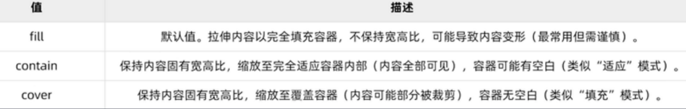

配合：
object-position：object-position控制内容在`容器`内的`对齐`位置（如center居中、top left 左上
角），常与object-fit搭配使用（例如cover时调整裁剪区域）。

### 项目对齐方式`父容器`

元素在网格内对齐。

1.justify-items:水平对齐方式；水平方向（行轴）
2.align-items:垂直对齐方式;垂直方向（列轴）

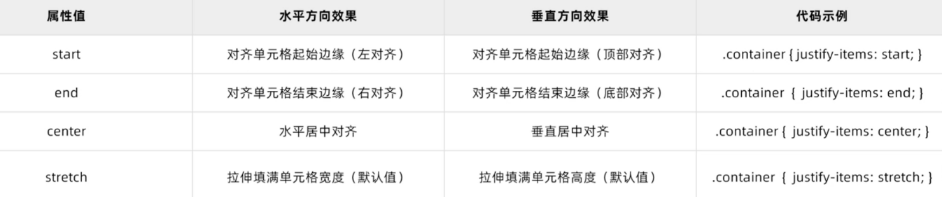3.place-items:水平+垂直方式;
为了提高可读性和兼容性，提倡使用`前面两种`方式

`justify-items` 作用于**网格项（单元格里的内容）**，`justify-content` 作用于**整个网格容器内的网格轨道（行 / 列整体）**。

## 多列布局

column-将元素的内容`自动分割`为指定数量的垂直列

场景：
1.`长`文章分栏。文章自动分列，中间有间隙，也可以做响应式。

2.图片`瀑布流`。 

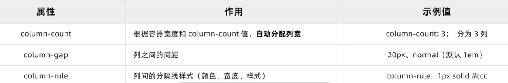

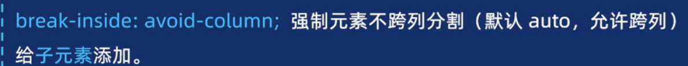

# 鼠标样式

在CSS中，`cursor`属性用于控制鼠标指针在元素上的显示样式，通过改变光标形态可以向用户传递交互提示
（如“可点击”“不可选中”等），从而提升界面交互体验。

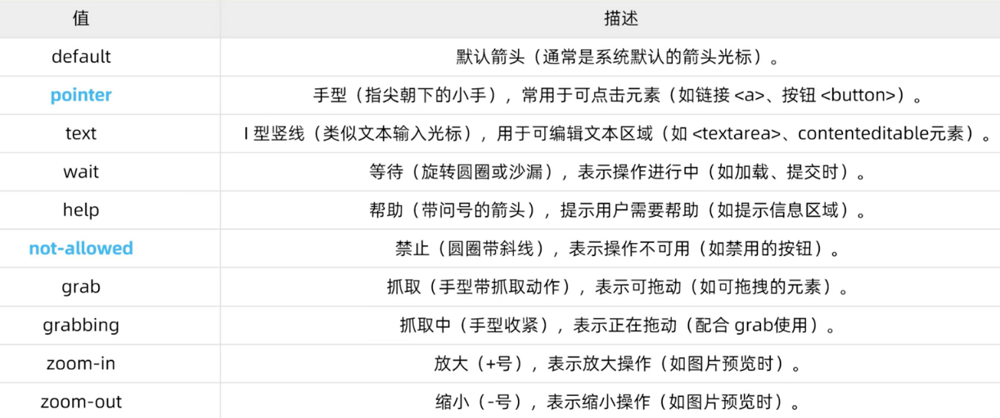

# 合理的属性顺序

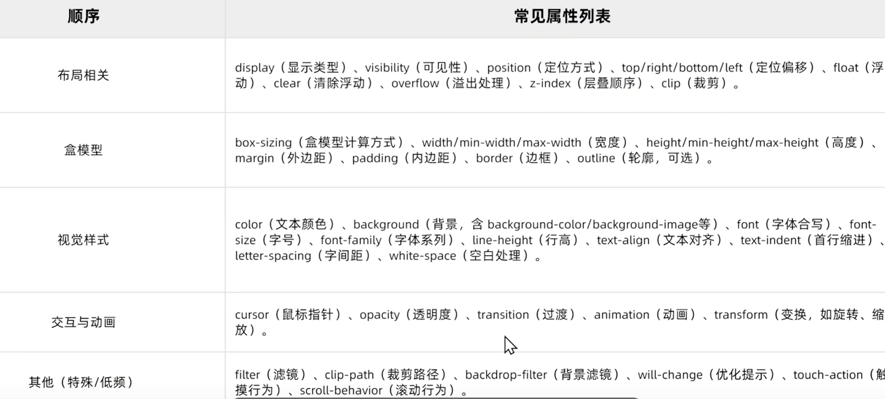

# 交互动态设计

## 变换

transform

CSS transform是元素进行2D/3D变换的核心属性，支持平移、旋转、缩放、倾斜等`效果`，且`不破坏`原有文档流布局。

` transform是属性，下面是属性值。`

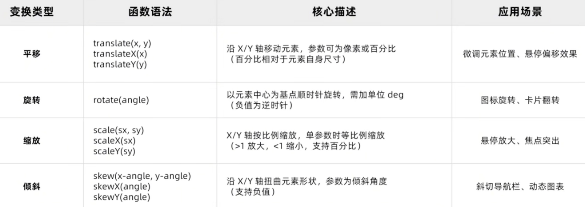

### sxz:平移 translate

平移（translate）沿X/Y轴移动元素位置，`不改变`元素的实际布局（`原位置`仍`保留`空白）|根据`原位置`移动右下。

场景：
1.悬停元素微调。鼠标放入元素上下或者左右移动（添加过渡更优雅~）
2.元素居中。元素实现水平垂直居中。

- 添加鼠标经过元素移动，优先transform而不是通过left、top等，性能更佳。
- 如果单位是`百分比`，相对于元素`自身`尺寸，而非父容器

### sxz:旋转 rotate

旋转（rotate）通过改变元素在平面或空间中的`角度`实现视觉效果。

场景：
1.悬停动画（如按钮旋转）

2.加载动画（无限循环旋转）

~~~css
transform-origin:left top;
~~~

transform-origin设置`旋转中心点`。

属性值支持left、top、也可单个top等，也可以支持数字比如像素和百分比等。

> `行内元素`不可使用。

### 缩放 scale

缩放（scale）用于`调整`元素尺寸，且`不改变`元素在文档流中的`原始`占位。

场景：
1.悬停放大等

~~~css
transform:scale(1.5);/放大/
transform:scale(1.5，1);/放大/
~~~

单参数：同时作用于X和Y轴（如scale（2）表示`整体`放大2倍）。
双参数：第一个控制`X轴`，第二个控制`Y轴`（如scale(0.5，1.5）横向缩小50%、纵向放大50%）

### 倾斜 skew

倾斜（skew）用于对元素进行二维倾斜变换，通过沿X轴或Y轴扭曲元素的几何形状。

场景：
1.鼠标经过元素倾斜效果。

~~~css
transform：skew(30deg，30deg);/倾斜/
transform：skewX(30deg);/倾斜/
transform：skewY(30deg);/倾斜/
~~~

如果只写一个参数则Y轴默认为0;`正`值`左`边，`负`值`右`边;

`transform-origin`设置`倾斜中心点`

### 过渡进阶

transition完整写法：
transition：过渡属性 持续时间 `速度曲线` 延迟时间；
transition:all 1s linear 1s;
所有属性添加过渡效果，过渡持续1秒，匀速，延迟1秒执行

- 速度曲线

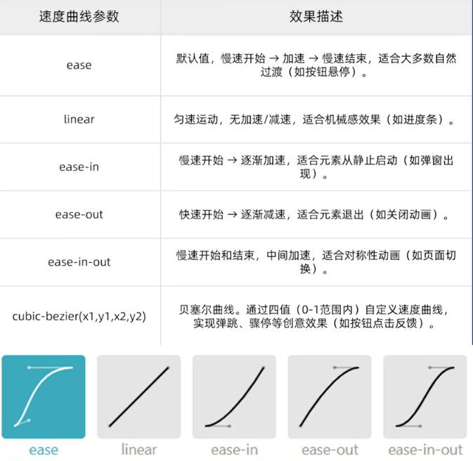

### 复合写法

~~~css
transform: A（） B（） C（）;
~~~

核心规则：`从右到左`的执行顺序;C->B->A

## 动画

## 动态案例

