# HTML

HTML--超文本标记语言

# 标签的介绍

## 标记也称标签（元素）

- 标签是由开始标签、结束标签、内容，三部分组成的。

### 标签分为双标签、单标签

- <html></html> <html>元素称为`根元素`。
- `<head></head> <head>元素称为头部元素。
- <mate charset="UTF-8"> 字符集设置为UTF-8。
- `<title></title> 设置最顶上显示的标题内容。 
- <body></body> 包含所有显示在页面上的内容。文本、图片、视频、游戏、可播放音频等等。

> HTML由一系列`标签组成`。

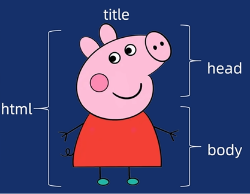

## 标签的关系

### 并列关系

（兄弟关系）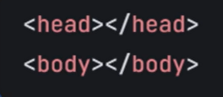

### 嵌套关系

（父子关系）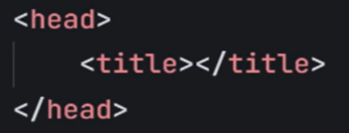

## 标题和段落标签以及语义化

### 标题标签

`<h1> 标签

特点:1.具有唯一性(h1)

2.(共有的)独占一行，加粗显示。

### 段落标签

`
标签

特点:每行显示一个，文字不会自动换行。

### 语义化

语义化指的是把杂乱的一团文字，清晰明了的分段分行呈现给人们。

好处:1.清晰的代码结构。

2.对搜索引擎更友好。

3.更好的访问性...

## 强调与重要性标签

语义化标签是 `有意义的容器`，纯 div 是 `无意义的盒子`

### 有语义加粗、倾斜、下划线、删除线

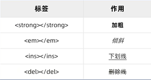

### 无语义加粗、倾斜、下划线、删除线

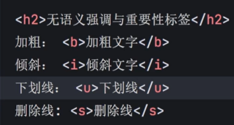

> 网页注释内容快捷键:  ctrl+/  <!-- xxx -->
>

# 标签的分类

`  换行`

`
水平线`

## 块级元素

- 独占一行
- 可以嵌套其他元素（除
、<h>） 
- 可以设置`宽度、高度以及边距`等样式属性

> p里面不能包含其他的块级元素p、h1等等

常见例如p、h、div等

## 行内元素

（内联）元素

- 一行可放多个
- 不能嵌套块元素，可嵌套其他内联元素
- 宽度默认由其内容决定(img 可以设置宽度大小等等)
- 常见例如strong、em、a等等

# 图片标签及常见格式

## 图片标签

 属性之间必须要有`空格`

- src 图像地址、图片的位置。

- alt 备选文本，`图片加载不出来`时候的文字显示。
- width、height分别对应 宽度、高度，建议css修改。
- title 图像标题，鼠标悬停显示文字。

## 图片常见格式

### jpeg、jpg

- 有损压缩
- 非透明

### png

- 无损压缩
- 透明

### webp

Google开发的现代格式。

- 支持有损、无损压缩，透明度和动画

### avif

- 基于AV1的视频编码，支持高压缩和HDR
- 压缩效率>webp

# 路径

## 绝对路径

相对于当前文件位置的路径。（相对于HTML的文件路径）

### 同一目录

./ 表示当前文件夹

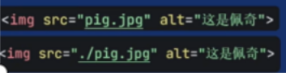

### 下级子目录

目录名/文件名

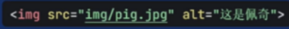

### 上级目录

../返回上一级

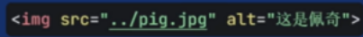

## 相对路径

从根目录开始的完整路径。（包含完整URL地址）

# 音视频标签

## 视频

`<video src="" controls=controls/controls width="300"></video>

> 键值相等可以省略 controls即可

src 指向要插入到页面的视频地址 

controls 显示浏览器自带`播放控件`

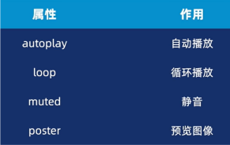

poster 视频未加载完成，填写图片来源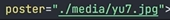

>  自动播放之前需要先静音！

### 视频标签兼容性

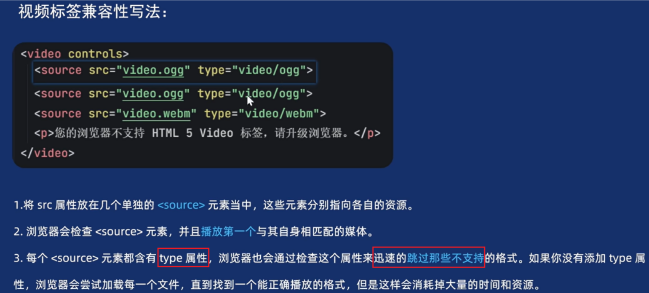

通过type属性，浏览器可迅速跳过不支持的格式。

### 商业写法

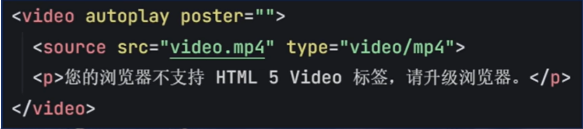

不支持最低版本的mp4，大概也都不支持，所以直接就显示不支持video。

## 音频

`<audio src="" type="" ></audio>

### 商业写法

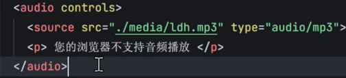

# 超链接

## 语法

### 属性介绍

- href="#" 是返回顶部。

  href="mailto:xxx@xxx" 可设为邮件

  href="download.exe" 可下载链接.exe

- title 鼠标悬停的提示文字。

- target `_self 当前窗口打开。`

  ​              _blank 新窗口打开。

### 锚点链接

- 定义锚点。<h2 id="1">第一部分</h2>
- 标记锚点(用`#`定义)。`<`a href="#1">跳转到第一部分</a>
- css代码-平滑滑到下面

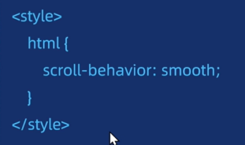

# 布局标签

## 网站结构标签

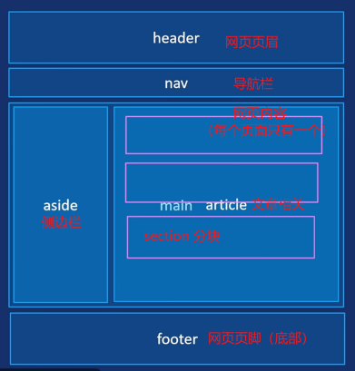

## 无语义标签

`<`div>块级元素、行内元素默认无语义。

详见 标签分类，块级元素、行内元素。 

## 列表标签

### 无序列表ul

ul->li

顺序`无关`紧要的列表

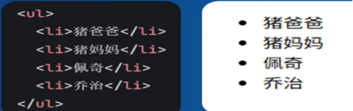

>  设置ul的时候，样式清零，内、外边距均要设置0！

### 有序列表ol

顺序`有关`紧要的列表

ol->li

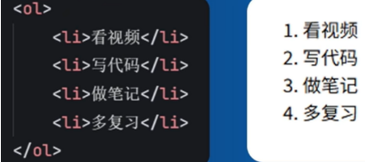

### 描述列表 dl

dl(大佬)->dt(大腿)->dd(弟弟)

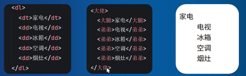

# 表格标签

## 表格组成

| 标签 | 作用 |
| :---: | :---: |
| `<table>` | 表单容器标签 |
| `<tr>` | 行标签 |
| `<td>` | 单元格标签 |
| `<th>` | 表头单元格 |

一整行横着的叫<tr>，每一个小的单元格叫<td>，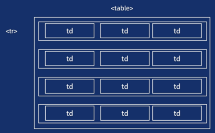

> 表头<th>是第一行单元格，字体加粗，居中对齐。

具体划分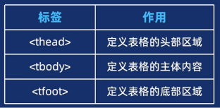

## 合并单元格

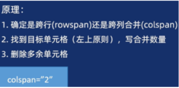

> 确定跨行还是跨列->左上原则，写数量->删除多余单元格

# 表单

## 表单容器

### `<`form action="">

定义表单的容器，包裹所有表单控件。

默认包含`action`属性。action属性定义了在提交表单时，应该把所收集的数据送给谁（URL）去处理。

## 表单控件

### `<`input>

通用输入控件，包含输入框、单选框、复选框等。

用type=" "来控制属性。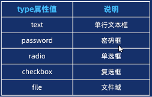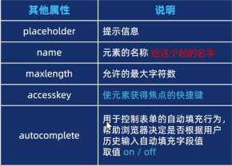

- test/password  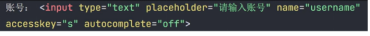
- radio/checkbox 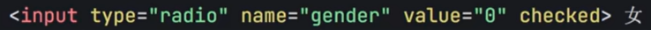

- file 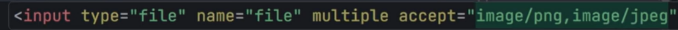

### `<`textarea>

多行纯文本输入框。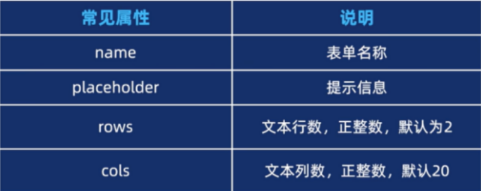

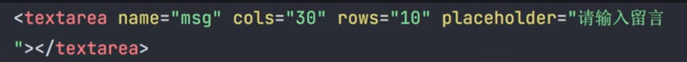

### `<`select>

下拉选择框。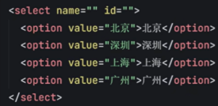

- 默认用`selected`属性，直接选中。

### `<`button>

自定义按钮。

- `disabled`属性可以禁用按钮，无法点击。与selected一样，直接使用。

## 辅助标签

### `<`label>

关联输入控件的文本标签，提升可访问性（点击标签可聚焦输入框），更好提高表单的用户体验。

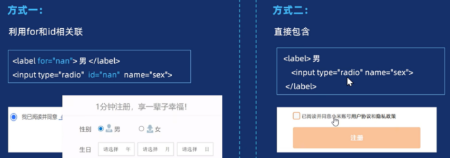

# 字符实体

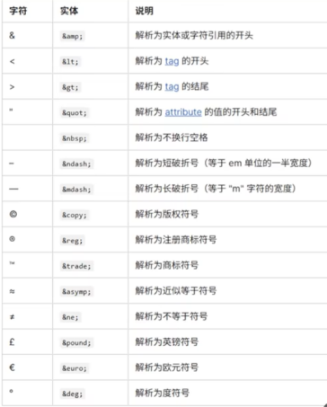

# 注意事项

写HTML的第一件事，先要`固定屏幕`大小

`内外边距都设为0`，然后`设置盒子为border-box`不会因为内外边距而撑大盒子。

html和body元素和当前可视化区一样大`width:100%;height:100%;`

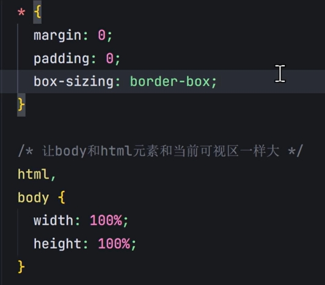 

 

的爸爸叫p，的爷爷叫

